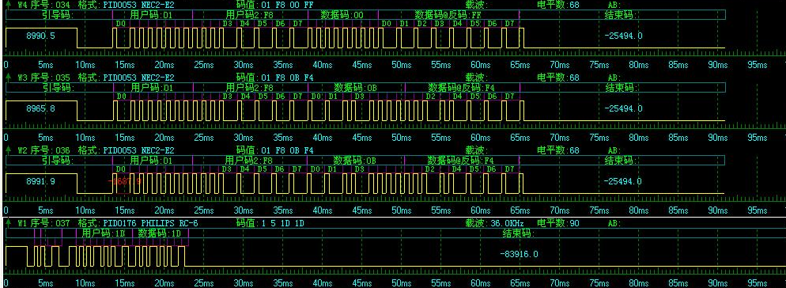

iR Control
----------

Una aplicación para poder controlar todos los dispositivos electronicos IR en tu hogar.

Requerimientos
----------
* HARDWARE jack

Como funciona
----------

Emite una señal usando Modulación por desplazamiento de fase no coherente (FSK NC), formando un par de bits (1,0) para estos a traves de memoria dinamica
emitir todo el protocolo que sea requerido en el dispositivo final.

Señal emitida
----------

## License
[LICENSE](https://github.com/osharim/iR-control/blob/master/LICENSE).

Contato
----------

**Bentel México**  
  
Website: [http://bentel.mx][1]

Contacto: [omar@bentel.mx][2]

Twitter: [http://twitter.com/osharim][3] 

  [1]: http://bentel.mx
  [2]: mailto:omar@bentel.mx
  [3]: http://twitter.com/osharim
